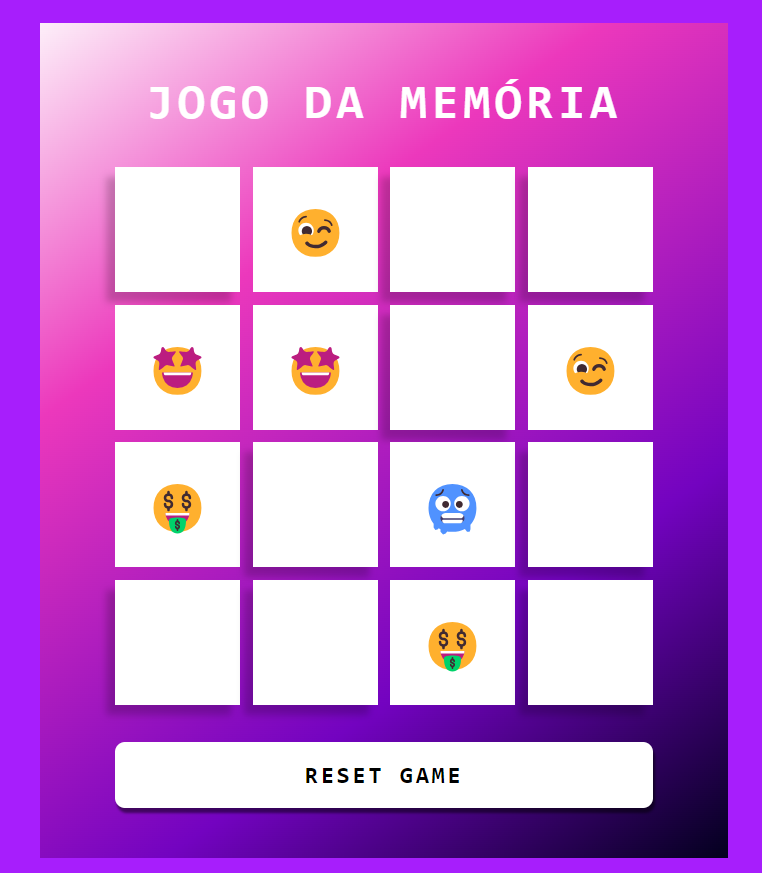

# Jogo da Memória Emojis - DIO

Seja Bem-Vindo ao jogo da memória com os emojis, um jogo que todos gostam e com o que mais usamos diariamente "emojis". 

 **Bora Jogar !!**

 

# **📈 OBJETIVO:**
### 📚 Aprendizado
### 🧠 Conhecimento
### ⭐ Sucesso
 

# **🛠 LINGUAGENS UTILIZADAS:**

  

